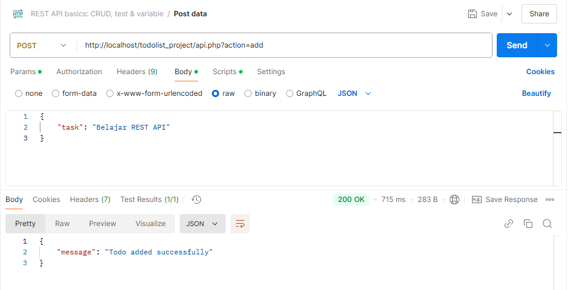
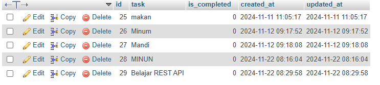

# Implementasi REST API pada project TodoList


## Struktur Folder Project

Berikut adalah struktur folder untuk proyek ini:

```plaintext
/todolist_project
├── index.php                    # Entry point aplikasi
├── api.php                      # API endpoint untuk operasi CRUD
├── .htaccess                    # Konfigurasi untuk URL rewriting
├── core
│   └── Database.php             # Koneksi database menggunakan PDO
├── models
│   ├── Todo.php                 # Model Todo yang merepresentasikan setiap task
│   └── TodoModel.php            # Model untuk operasi CRUD pada database
├── controllers
│   └── TodoController.php       # Controller untuk mengatur logika bisnis Todo
├── views
│   └── listTodos.php            # Template/view untuk menampilkan daftar Todo
└── assets
    ├── css
    │   └── style.css            # file CSS untuk styling
    └── js
        └── script.js            # file JavaScript untuk interaksi tambahan
```


## Hasil Output

Data berhasil ditambahkan:


