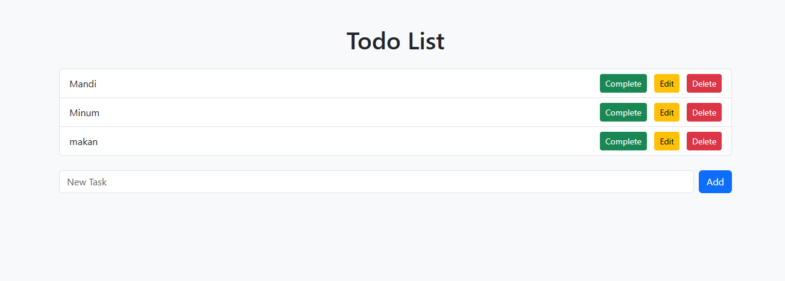

# Aplikasi Todo List

Aplikasi Todo List ini dibuat menggunakan PHP dan MySQL. Aplikasi ini memungkinkan pengguna untuk membuat, mengedit, menyelesaikan, dan menghapus tugas dalam daftar.

**Halaman Daftar Todo**

## Fitur Aplikasi
- **Tambah Tugas:** Pengguna dapat menambahkan tugas baru ke dalam daftar.
- **Tandai Tugas Selesai:** Pengguna dapat menandai tugas yang sudah selesai.
- **Edit Tugas:** Pengguna dapat mengedit tugas yang telah dibuat.
- **Hapus Tugas:** Pengguna dapat menghapus tugas dari daftar.
- **Tampilan Responsif:** Tampilan aplikasi menggunakan Bootstrap sehingga nyaman digunakan di perangkat mobile dan desktop.

## Pengaturan Database

1. Buatlah database baru di MySQL dengan perintah berikut:
CREATE DATABASE todolist_db;

USE todolist_db;

CREATE TABLE todos (
    id INT AUTO_INCREMENT PRIMARY KEY,
    task VARCHAR(255) NOT NULL,
    is_completed BOOLEAN DEFAULT 0,
    created_at TIMESTAMP DEFAULT CURRENT_TIMESTAMP,
    updated_at TIMESTAMP DEFAULT CURRENT_TIMESTAMP ON UPDATE CURRENT_TIMESTAMP
);

2. Pastikan untuk menyesuaikan pengaturan koneksi database di file core/Database.php.

## Cara Install
Clone atau download proyek ini.
Jalankan server lokal seperti XAMPP atau MAMP yang sudah dilengkapi dengan PHP dan MySQL.
Buat database menggunakan SQL yang sudah disediakan.
Sesuaikan pengaturan database di file config/Database.php (username dan password default adalah root).
Akses aplikasi melalui browser.

## Penggunaan
1. Menambahkan Tugas: Cukup ketikkan tugas pada kolom input dan klik tombol "Add".
2. Menandai Tugas Selesai: Klik tombol "Complete" pada tugas yang telah selesai.
3. Mengedit Tugas: Klik tombol "Edit" untuk mengubah tugas yang ada.
4. Menghapus Tugas: Klik tombol "Delete" untuk menghapus tugas.