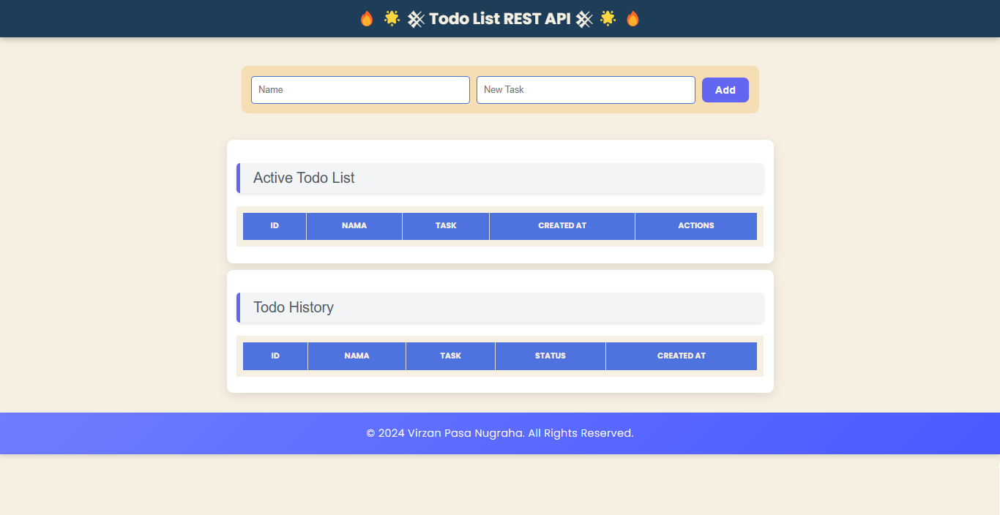
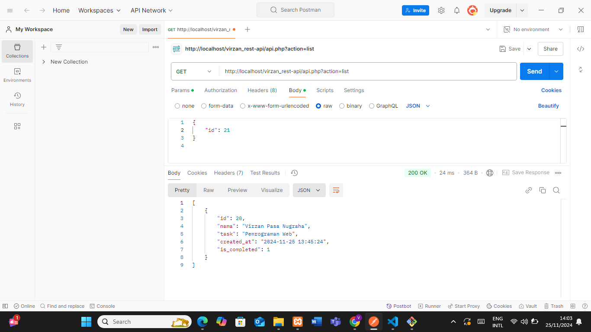
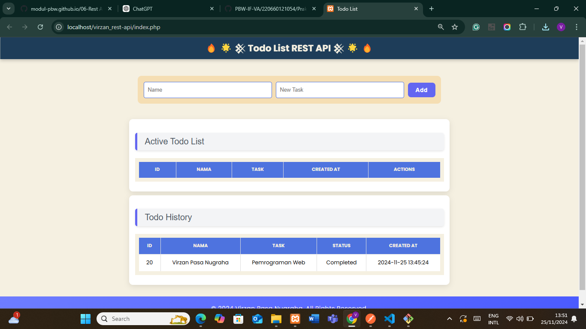
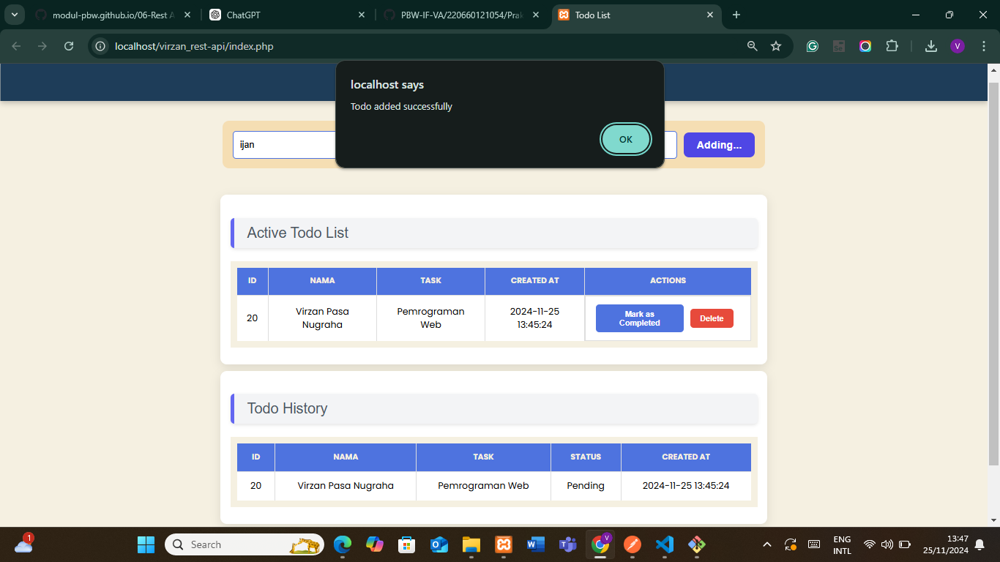
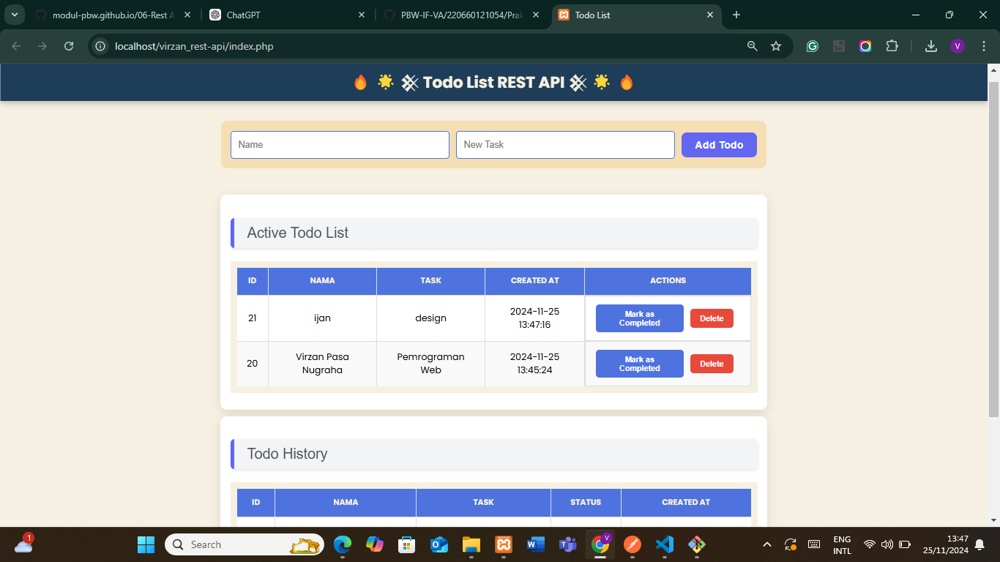
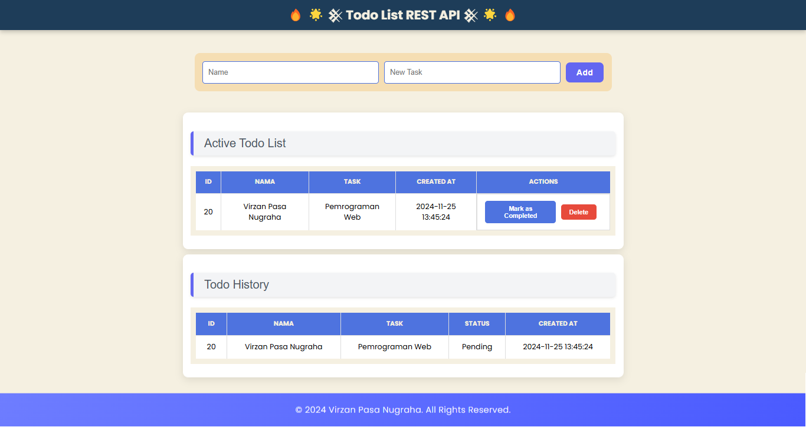
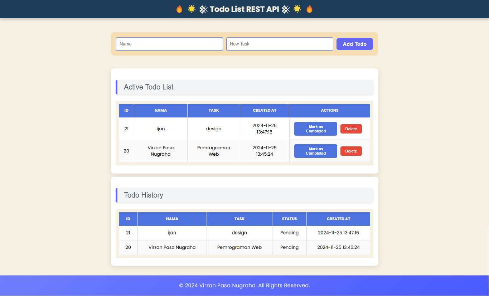
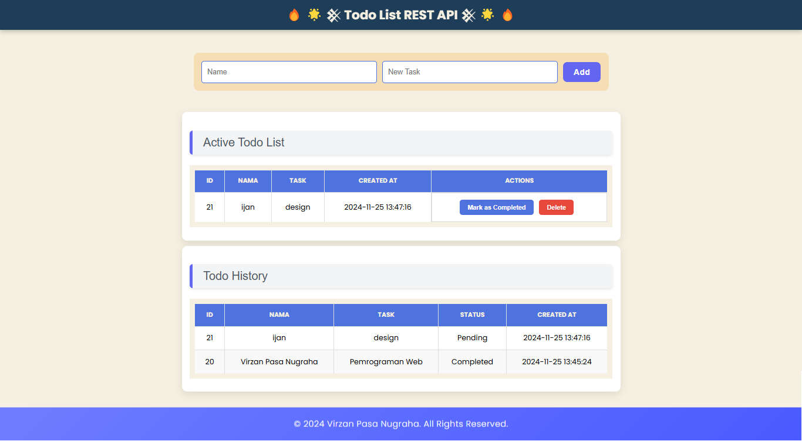
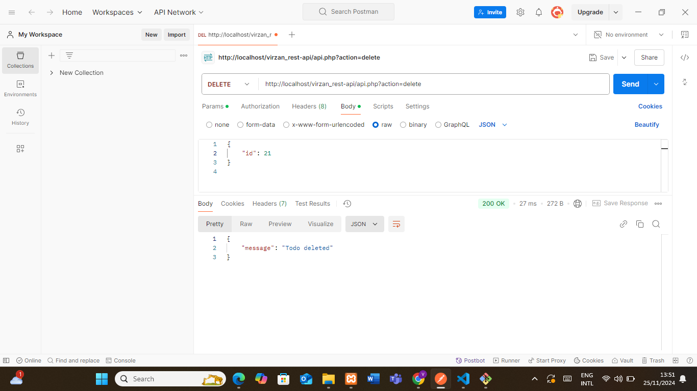

# 🔥 🌟 𒆜 Todo List REST API 𒆜 🌟 🔥

## 📋 Deskripsi  
Aplikasi **Todo List REST API** adalah proyek berbasis web yang memungkinkan pengguna untuk:
- Menambahkan tugas baru bisa di POSTMAN dan Localhost.
- Melihat daftar tugas aktif di POSTMAN dan Localhost.
- Melihat riwayat tugas yang selesai dan dihapus dan untuk di hapus nilai Id nya akan terlihat telewat.
- Menghapus tugas secara dinamis melalui POSTMAN dan Localhost.

Aplikasi ini didesain dengan antarmuka yang modern dan responsif untuk pengalaman pengguna yang maksimal.

---

## 🚀 Fitur Utama  
1. **Tambah Tugas Baru**  
   - Inputkan nama dan task tugas.
   - Tugas baru langsung masuk ke daftar aktif dan History .

2. **Daftar Tugas Aktif**  
   - Menampilkan tugas yang sedang dikerjakan dalam tabel interaktif.

3. **Riwayat Tugas**  
   - Riwayat tugas selesai atau dihapus untuk referensi di masa mendatang.

5. **Hapus Tugas**  
   - Hapus tugas dari daftar aktif dengan satu klik.

6. **Dinamis dan Responsif**  
   - Dijalankan menggunakan AJAX untuk memastikan pengalaman yang mulus tanpa perlu reload halaman.

---

## 🛠️ Teknologi yang Digunakan  
1. **Frontend**  
   - **HTML5**: Struktur halaman.
   - **CSS**: Desain visual antarmuka.
   - **Font Awesome**: Ikon tambahan untuk mempercantik UI.
   - **JavaScript (AJAX)**: Untuk komunikasi dengan server REST API.

2. **Backend**  
   - REST API untuk mengelola data Todo List.

---

## 🎨 Tampilan Halaman  
1. **Form Tambah Tugas**  
   - Form sederhana dengan input untuk nama dan task.
2. **Tabel Tugas Aktif**  
   - Tabel berisi daftar tugas yang sedang berlangsung.
3. **Tabel Riwayat Tugas**  
   - Riwayat tugas selesai atau dihapus.

---

## 📂 Struktur File  
- **index.php**: Merupakan entry point utama untuk aplikasi ini. Di sini pengguna dapat melihat daftar Todo dan melakukan interaksi.
  
- **api.php**: Menyediakan endpoint API untuk operasi CRUD (Create, Read, Update, Delete) pada Todo.

- **.htaccess**: Digunakan untuk konfigurasi URL rewriting agar aplikasi dapat berjalan dengan rapi.

- **core/Database.php**: File ini menangani koneksi ke database menggunakan PDO, memastikan aplikasi dapat berkomunikasi dengan database secara aman dan efisien.

- **Gambar_Hasil**: Berisi tampilan hasil yang telah dibuat, seperti screenshot dan representasi visual dari aplikasi yang berjalan.

- **models/Todo.php**: Model ini merepresentasikan setiap task (Todo) dalam aplikasi, berisi struktur dan atribut task.

- **models/TodoModel.php**: Mengelola operasi CRUD pada database, termasuk menambah, mengedit, menghapus, dan mengambil data Todo.

- **controllers/TodoController.php**: Controller ini mengatur logika bisnis aplikasi, termasuk memanggil model dan mengirimkan data ke views.

- **views/listTodos.php**: Template/view yang menampilkan daftar Todo yang ada di aplikasi. Digunakan untuk menampilkan data yang diambil oleh controller.

- **assets/css/style.css**: File CSS yang digunakan untuk memberikan style dan tata letak pada halaman aplikasi.

- **assets/js/script.js**: File JavaScript untuk memberikan interaksi tambahan pada aplikasi, seperti menangani event klik dan memperbarui tampilan secara dinamis.

---

## 💻 Cara Menjalankan  
1. Pastikan backend REST API berjalan di server.
2. Tempatkan file frontend sesuai struktur direktori:
   - CSS di `/assets/css/style.css`
   - JS di `/assets/js/script.js`
3. Buka file `index.html` di browser.

---

## 🌟 Preview  

**Tampilan Kosong**:
 

 ---
**GET api.php?action=list - Mendapatkan semua todo**:  

---
**POST api.php?action=add - Menambahkan todo baru**:

---
**PUT api.php?action=complete - Menandai todo sebagai selesai**:

---
**DELETE api.php?action=delete - Menghapus todo**:

---

## 📝 Lisensi  
&copy; 2024 Virzan Pasa Nugraha. All Rights Reserved.

---

README ini menjelaskan proyek secara menyeluruh dan memberikan informasi untuk membantu pengguna memahami serta menjalankan aplikasi. Apakah ada yang perlu ditambahkan? 😊