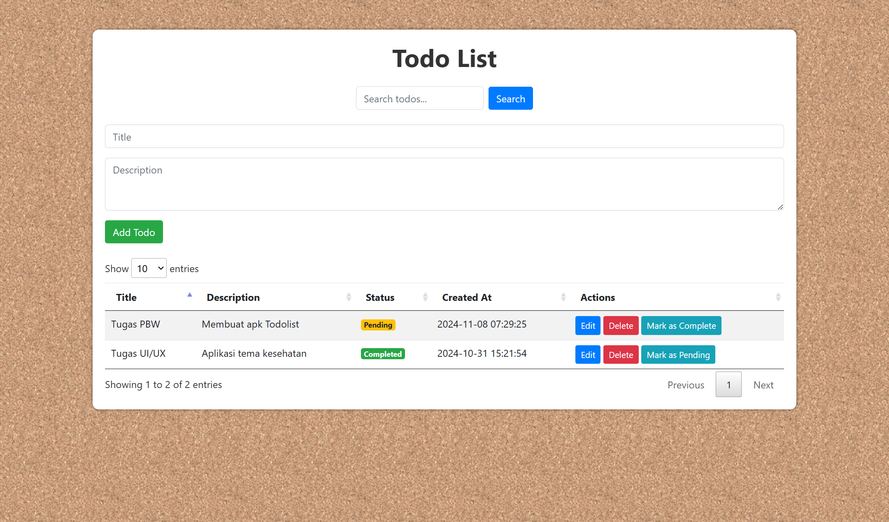
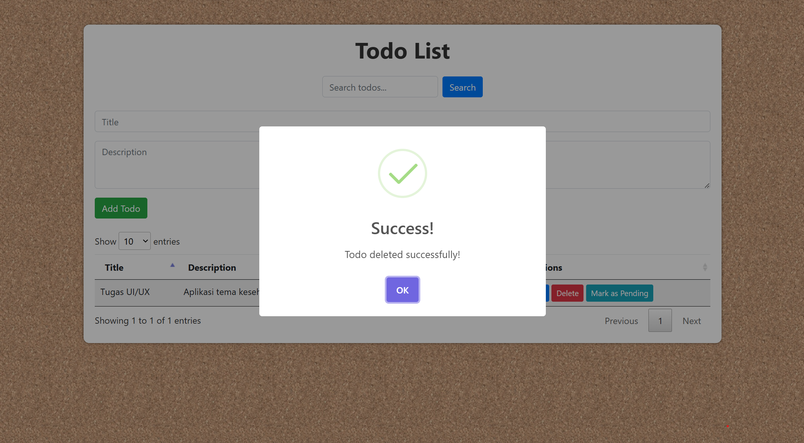

# Todo List Web Application

Aplikasi **Todo List** ini dikembangkan menggunakan PHP sebagai backend, dengan tambahan fungsionalitas interaktif dan tampilan yang lebih menarik menggunakan **CSS custom**, **Bootstrap**, **jQuery**, **DataTables**, dan **SweetAlert**.

## 📋 Fitur Aplikasi

Aplikasi ini memiliki beberapa fitur utama sebagai berikut:

1. **CRUD Lengkap**:

   - Tambah, Lihat, Ubah, dan Hapus data todo.
   - Menggunakan **SweetAlert** untuk notifikasi interaktif saat melakukan aksi CRUD.

2. **Pagination & Sorting**:

   - Menggunakan **DataTables** untuk fitur pagination dan sorting otomatis.
   - Fitur **searching bawaan DataTables dimatikan** agar dapat dikustomisasi secara manual.

3. **Searching Manual**:

   - Implementasi pencarian manual menggunakan **jQuery** untuk meningkatkan fleksibilitas.

4. **Notifikasi Interaktif**:
   - Menggunakan **SweetAlert** untuk menampilkan notifikasi pada setiap aksi seperti menambahkan, memperbarui, atau menghapus todo, serta mengubah status.

## 🛠️ Teknologi & Library yang Digunakan

- **PHP**: Backend logic dan pengelolaan data.
- **CSS Custom**: Mempercantik tampilan aplikasi.
- **Bootstrap**: Framework CSS untuk membuat layout responsif.
- **DataTables**: Fitur pagination dan sorting yang cepat dan dinamis.
- **jQuery**: Mempermudah manipulasi DOM dan AJAX.
- **SweetAlert**: Menampilkan pop-up notifikasi yang menarik.

## ⚙️ Cara Instalasi

1. Clone repository
2. Pindahkan ke direktori project
3. Pastikan server Apache dan MySQL berjalan (gunakan XAMPP atau LAMPP).
4. Buat database baru dan impor file todolist_db.sql yang ada di folder db.
5. Atur konfigurasi database di file core/Database.php.

## 🚀 Cara Menjalankan Aplikasi

1. Buka browser dan akses:
   http://localhost/direktori-project-todo-list-anda
2. Mulai mengelola daftar tugas Anda!

## 📸 Screenshot

**Halaman Daftar Todo**

**Notifikasi SweetAlert**

